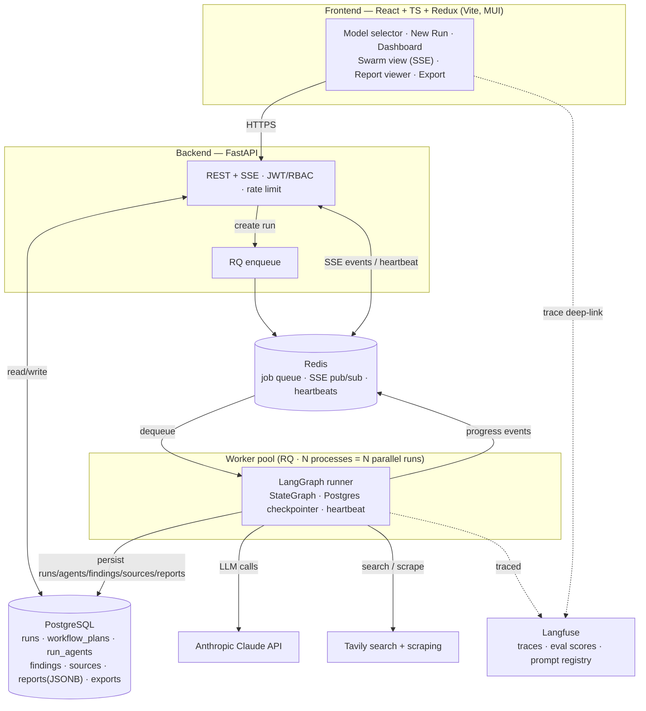
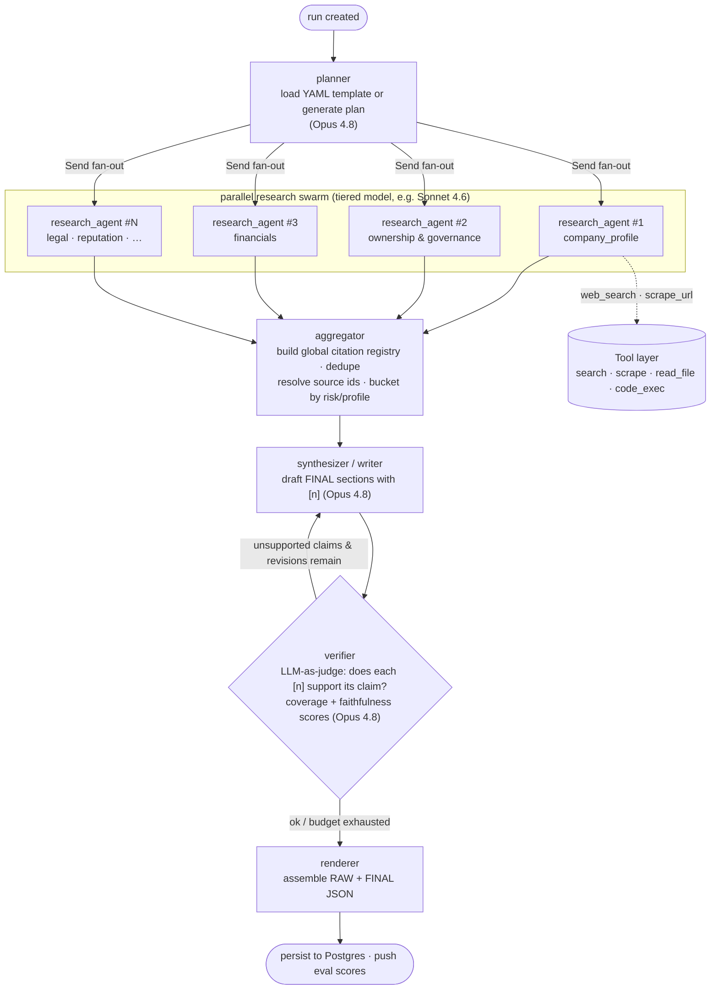

# Deep Due-Diligence — Multi-Agent Research & Report Platform

A full-stack platform that runs **deep multi-agent due-diligence research** on **companies**
and **individuals** using Claude models, and produces **cited reports** with verified
`[n]` hyperlinked citations.

Every run produces **two artifacts**, both stored as JSON, viewable in the UI, and
exportable to **PDF** and **Word**:

- **RAW report** — complete per-agent visibility (every research agent's full output + every source).
- **FINAL report** — a consolidated, sectioned, citation-verified deliverable.

The pipeline is orchestrated with **LangGraph** (orchestrator–worker pattern), observed in
**Langfuse**, persisted in **PostgreSQL**, and the Claude model is **configurable from the
UI** at run level and per role/agent (default `claude-opus-4-8`).

> **Setup & run instructions live in [SETUP.md](SETUP.md).** This file is the architecture
> and reference guide.

---

## Table of contents

- [Highlights](#highlights)
- [Architecture](#architecture)
- [Agent orchestration (the pipeline)](#agent-orchestration-the-pipeline)
- [The five pipeline nodes](#the-five-pipeline-nodes)
- [Tech stack](#tech-stack)
- [Repository layout](#repository-layout)
- [Quick start](#quick-start)
- [Configuration (`.env`)](#configuration-env)
- [Workflow config (YAML)](#workflow-config-yaml)
- [Model selection](#model-selection)
- [Citations & verification](#citations--verification)
- [Parallel runs & workers](#parallel-runs--workers)
- [Resumability & liveness](#resumability--liveness)
- [API reference](#api-reference)
- [Observability (Langfuse)](#observability-langfuse)
- [Compliance & ethics](#compliance--ethics)
- [Acceptance criteria](#acceptance-criteria)

---

## Highlights

| Capability | Detail |
|---|---|
| Two subject types | **Company** and **Individual**, each with its own required report sections. |
| Orchestrator–worker swarm | A planner fans out a parallel swarm of research agents, then aggregate → write → verify → render. |
| Verified citations | Every FINAL claim is grounded by an LLM-as-judge verifier against stored source text; coverage + faithfulness scored. |
| RAW + FINAL artifacts | Stored as JSONB; rendered to markdown; exportable to PDF/Word with clickable `[n]` links. |
| UI model selection | Global default + per-role overrides + per-agent overrides, fed by a server-driven catalog. |
| Live progress | SSE stream drives a live swarm view (per-agent pending → running → completed) with spinners. |
| Resumable | Postgres checkpointer; a failed/interrupted run resumes from its last completed node. |
| Parallel runs | A pool of background workers runs multiple reports concurrently. |
| Observed | One Langfuse trace per run, nested spans per node/agent/tool, eval scores, prompt registry. |

---

## Architecture



---

## Agent orchestration (the pipeline)

A single **planner** owns the plan and delegates to a parallel **research swarm**; an
**aggregator** consolidates; a **synthesizer** writes; a **verifier** grounds every claim
(looping back to the writer on failures); a **renderer** assembles both reports.



The revise loop (`verifier ⇄ synthesizer`) is bounded by `MAX_REVISIONS`. The whole graph
is bounded by `RECURSION_LIMIT` super-steps.

**Mapping to the workflow definitions:** `plan.agents[]` (with `depends_on`) is the
orchestrator's decomposition. Agents whose tools include `web_search`/`scraper` become the
parallel swarm. The `risk_aggregator` agent maps to the aggregator node; `report_synthesizer`
maps to the writer; citation enforcement maps to the verifier.

---

## The five pipeline nodes

| Node | Role | Model (default) |
|---|---|---|
| **planner** | Resolve the run into a `WorkflowPlan` — load the subject-type YAML template, or generate one. Emits the research swarm. | Opus 4.8 |
| **research_agent** (×N, parallel) | Each runs a tool loop (search → scrape → extract) up to `max_iterations`, returning a narrative + structured findings with source URLs. | Sonnet 4.6 |
| **aggregator** | Build the global citation registry (dedupe by canonical URL, assign stable `[n]` ids), resolve findings → source ids, dedupe, bucket by risk (company) / profile (individual). | Opus 4.8 |
| **synthesizer** | Draft the required FINAL sections from the findings + full raw narratives + numbered source list, citing `[n]` for every sourced statement. | Opus 4.8 |
| **verifier** | LLM-as-judge: for each cited claim, check the cited source text supports it. Compute coverage + faithfulness, flag failures, loop back to the writer if budget remains. | Opus 4.8 |
| **renderer** | Assemble the RAW report (per-agent narratives + sources) and FINAL report (verified sections + scores + hyperlinked citations). | — |

---

## Tech stack

| Layer | Choice |
|---|---|
| Frontend | React 18 + TypeScript, Vite, Redux Toolkit + RTK Query, React Router, MUI |
| Backend | FastAPI (Python 3.11+), Pydantic v2, async endpoints, Uvicorn/Gunicorn |
| Orchestration | LangGraph (`StateGraph`, `Send` fan-out, Postgres checkpointer), `langchain-anthropic` |
| LLM | Anthropic Claude API (default `claude-opus-4-8`) |
| Observability | Langfuse v3 (`langfuse.langchain.CallbackHandler`, prompt registry, eval scores) |
| Jobs | RQ + Redis (worker pool) |
| DB | PostgreSQL 15+, SQLAlchemy 2.0 + Alembic, JSONB for report payloads |
| Realtime | Server-Sent Events (Redis pub/sub) |
| Export | PDF via WeasyPrint, Word via `python-docx` |
| Auth | JWT bearer + minimal RBAC (admin/analyst/viewer) |

---

## Repository layout

```
deep-dd/
├── backend/
│   ├── app/
│   │   ├── main.py                 # FastAPI app (CORS, rate limit, fail-fast startup)
│   │   ├── api/                    # auth, runs, models, uploads
│   │   ├── core/                   # config, prompts, security, events, storage, observability, ratelimit
│   │   ├── db/                     # SQLAlchemy models, session, alembic/
│   │   └── schemas/                # Pydantic data contracts (§5)
│   ├── workflow/
│   │   ├── graph.py                # StateGraph wiring + Send fan-out
│   │   ├── state.py                # reducer-merged graph state
│   │   ├── runner.py               # executor: checkpointer, trace, heartbeat, persistence
│   │   ├── config_loader.py        # YAML/JSON → WorkflowPlan (validates cycles/tools)
│   │   ├── citations.py            # global citation registry
│   │   ├── models.py               # model resolution + catalog
│   │   ├── llm.py                  # LLM JSON invocation + cost accounting
│   │   ├── tools.py                # web_search · scrape_url · read_file · code_executor
│   │   └── nodes/                  # planner, research, aggregator, synthesizer, verifier, renderer
│   ├── exporters/                  # html, pdf (WeasyPrint), docx (python-docx)
│   ├── worker.py                   # RQ worker entrypoint (SimpleWorker on macOS)
│   ├── cli.py                      # headless run (no API/DB/UI needed)
│   ├── tests/                      # pytest unit tests
│   ├── alembic.ini · requirements.txt · .env.example
├── frontend/
│   ├── src/ (app/store.ts, api/, features/{runForm,runStream,viewer}/, components/, routes/)
│   ├── package.json · vite.config.ts · .env.example
├── config/                         # agents/tasks YAML for company + individual
├── scripts/setup/                  # setup-all · setup-fresh · run-local · stop-local · verify-all
├── docker-compose.yml
├── README.md  (this file)
└── SETUP.md
```

---

## Quick start

See **[SETUP.md](SETUP.md)** for full details. The short version (local dev):

```bash
cd deep-dd
scripts/setup/setup-all.sh      # install backend venv + frontend deps
scripts/setup/setup-fresh.sh    # create .env files, bring up DB, run migrations
# add ANTHROPIC_API_KEY and TAVILY_API_KEY to backend/.env-dev
scripts/setup/run-local.sh      # start API + worker pool + frontend
scripts/setup/verify-all.sh     # confirm UI/API/DB/Redis/env
```

API → http://localhost:8000 (docs at `/docs`) · Frontend → http://localhost:5173

Headless (no API/DB/UI):

```bash
cd backend && python cli.py --subject "Anunta Technology Management Services Limited" --type company
```

---

## Configuration (`.env`)

All settings are read from a single `.env` file via typed `pydantic-settings`
([`app/core/config.py`](backend/app/core/config.py)); the server **fails fast** on missing
required keys. Secrets never reach the client. `.env`/`.env-dev` are git-ignored; commit
`.env.example` (placeholders only). The frontend only sees `VITE_`-prefixed vars.

| Group | Key | Purpose |
|---|---|---|
| LLM | `ANTHROPIC_API_KEY` *(required)* | Claude API key |
|  | `DEFAULT_MODEL` / `RESEARCH_MODEL` / `VERIFIER_MODEL` | system defaults per role |
| Observability | `LANGFUSE_PUBLIC_KEY` / `LANGFUSE_SECRET_KEY` / `LANGFUSE_HOST` | tracing (optional) |
| Search/tools | `TAVILY_API_KEY` | web search/scraping |
|  | `REQUEST_TIMEOUT_SECONDS` | HTTP scrape timeout |
|  | `LLM_TIMEOUT_SECONDS` / `LLM_MAX_RETRIES` | Anthropic call timeout + retries |
| Content depth | `SEARCH_MAX_RESULTS` | results per web_search |
|  | `SEARCH_DEPTH` | `basic` (fast) or `advanced` (deeper) |
|  | `SEARCH_INCLUDE_RAW_CONTENT` | store full page text for the verifier |
|  | `SCRAPE_MAX_CHARS` | per-page text cap |
|  | `RESEARCH_MAX_TOKENS` / `SYNTHESIZER_MAX_TOKENS` / `AGGREGATOR_MAX_TOKENS` / `VERIFIER_MAX_TOKENS` | per-stage output budgets (raise for richer/longer reports) |
|  | `VERIFIER_SOURCE_CHARS` | source text shown to the verifier per claim |
| DB/jobs | `DATABASE_URL` *(required)* / `REDIS_URL` | Postgres + Redis |
| Workflow tuning | `MAX_REVISIONS` | verifier→writer revise loop cap |
|  | `MAX_SUBAGENTS` | research swarm size cap |
|  | `RECURSION_LIMIT` | LangGraph super-step guard (keep ≥ ~10; default **50**) |
|  | `RUN_BUDGET_USD` | soft per-run cost ceiling (warn) |
| Auth | `JWT_SECRET` *(required)* / `JWT_EXPIRY_MINUTES` / `CORS_ALLOWED_ORIGINS` | auth + CORS |
| Storage | `EXPORT_STORAGE_URI` | `file://…` or `s3://…` for exports |
| Frontend | `VITE_API_BASE_URL` | API base URL (non-secret) |

> ⚠️ `RECURSION_LIMIT` is a safety guard, **not** a research-depth knob. The graph needs
> ~6–10 super-steps; values below that abort runs mid-flight. Keep it at **50**.

---

## Workflow config (YAML)

Agent role/goal/tools and the task DAG are externalized under [`config/`](config/) as
CrewAI-style pairs — `agents.<type>.yaml` + `tasks.<type>.yaml` — one pair per subject type.
A single loader ([`workflow/config_loader.py`](backend/workflow/config_loader.py)) normalizes
them into the runtime `WorkflowPlan`, validating unknown agent references, dependency
cycles, and unknown tool names (fail-fast). Legacy `.json` plan exports import on the same
path. Plans can also be **generated** by the orchestrator (when no template exists) or
**edited from the UI** (`GET/PUT /api/runs/{id}/plan`) — all produce the same normalized plan.

```yaml
# config/agents.company.yaml (excerpt)
company_profile_researcher:
  role: Company Profile Analyst
  goal: Gather business model, services, footprint, employee count, founding history…
  tools: [web_search, scraper]
  max_iterations: 10
  model: claude-sonnet-4-6     # optional per-agent override
```

---

## Model selection

Resolution precedence (highest first), in [`workflow/models.py`](backend/workflow/models.py):

```
per-agent override (plan.agents[].model)
  → per-role default (model_config.role_overrides[role])
    → run-level global default (model_config.global_default)
      → system default (claude-opus-4-8)
```

The catalog is **server-driven** (`GET /api/models`) so models can be added without a UI
deploy. The UI's ModelSelector sets the global default and per-role overrides; advanced
users can edit per-agent models in the plan.

---

## Citations & verification

- A **global citation registry** dedupes sources by canonical URL and assigns stable
  integer ids `[1], [2], …` in order of first appearance across all agents.
- Every factual statement in the FINAL report ends with one or more `[n]` markers that
  render as **hyperlinks to the source URL**.
- The **verifier** runs an LLM-as-judge faithfulness check per cited claim against the
  stored source text, computes a **citation coverage** and **faithfulness** score (both
  pushed to Langfuse as eval scores), and flags unsupported claims.
- Unsupported claims trigger a revise loop, or are dropped / labelled `[unverified]` /
  `[estimate]` — never silently asserted. Net-worth/financial figures must be sourced or
  labelled estimates with the basis stated.

---

## Parallel runs & workers

Runs execute out-of-band in a **pool of RQ workers** — one job per worker at a time, so the
pool size = the number of reports that run concurrently. `run-local.sh` starts
`WORKER_CONCURRENCY` workers (default **3**):

```bash
WORKER_CONCURRENCY=5 scripts/setup/run-local.sh dev   # 5 parallel runs
# Docker: docker compose up --scale worker=3
```

Within a single run, the research swarm branches execute in parallel threads (LangGraph
Pregel). Note: more concurrency multiplies token spend and pressure on Anthropic/Tavily
rate limits.

---

## Resumability & liveness

- **Postgres checkpointer** snapshots state per super-step. A failed/interrupted run can be
  **resumed** (`POST /api/runs/{id}/resume`) and continues from its last completed node —
  research already done is not repeated.
- A **heartbeat** beacon (Redis, refreshed by a background thread) lets the UI distinguish
  "alive but on a slow call" from "worker died". A run with no live heartbeat is shown as
  stalled and is reconciled to `failed` (resumable) at worker startup.
- The **live swarm view** (SSE) shows every research agent as a card transitioning
  pending → running → completed, plus pipeline-stage chips and a Langfuse trace deep-link.

---

## API reference

All run-creating endpoints enqueue a background job and return immediately. Auth is JWT
bearer (`POST /api/auth/register` / `login`).

```
POST   /api/runs                       create run; returns {run_id, status:"queued"}
GET    /api/runs                       paginated list (filters: subject_type, status)
GET    /api/runs/{id}                  run metadata + status + verification + liveness
GET    /api/runs/{id}/stream           SSE: planner/agent/tool/verifier progress (token via ?token=)
GET    /api/runs/{id}/plan             resolved WorkflowPlan
PUT    /api/runs/{id}/plan             edit plan before execution
POST   /api/runs/{id}/cancel           cancel a running job
POST   /api/runs/{id}/resume           re-enqueue a failed/cancelled run (resumes from checkpoint)
POST   /api/runs/{id}/review           mark reviewed (human-approval gate before export)
GET    /api/runs/{id}/raw              RAW report JSON
GET    /api/runs/{id}/final            FINAL report JSON
GET    /api/runs/{id}/export?format=pdf|docx&report=raw|final   file download (auth header)
GET    /api/runs/{id}/trace            Langfuse trace deep-link
GET    /api/models                     model catalog
POST   /api/uploads                    upload supporting docs
GET    /health                         liveness
```

---

## Observability (Langfuse)

One trace per run (forced to a deterministic id derived from the run id), with nested spans
per node/agent/tool via the LangChain `CallbackHandler`. Verifier scores
(`citation_coverage`, `faithfulness`) are pushed as eval scores. Prompt templates are
registered in the Langfuse prompt registry and refreshed when the local templates change.
The Run Detail screen surfaces the project-scoped trace deep-link. Langfuse is optional —
everything is a safe no-op when keys are absent.

---

## Compliance & ethics

Research uses **public sources only**; every claim is cited; estimates and unverified items
are labelled. Reports carry a standing disclaimer that they are **decision-support, not a
background-check product**, and must be human-reviewed before informing any decision. Human
gates: plan approval before expensive research, and a "mark reviewed" action before export.
For individuals, unverified derogatory claims are avoided (defamation risk).

---

## Acceptance criteria

| # | Requirement | Where |
|---|---|---|
| 1 | React+TS+Redux UI, live progress + reports | `frontend/src` |
| 2 | FastAPI + LangGraph + SSE + Langfuse | `backend/app`, `backend/workflow`, `app/core/observability.py` |
| 3 | PostgreSQL persistence | `app/db`, `app/db/alembic` |
| 4 | RAW+FINAL as JSON (`reports.report_json`) | `workflow/runner.py`, `app/db/models.py` |
| 5 | Viewable + PDF/Word export with `[n]` links | `components/ReportViewer`, `exporters/` |
| 6 | UI model selection (run + role/agent) | `components/ModelSelector`, `workflow/models.py` |
| 7 | Verified citations | `workflow/nodes/verifier.py`, `workflow/citations.py` |
| 8 | RAW + FINAL formats, both subject types | `workflow/nodes/{renderer,synthesizer}.py` |
| 9 | `.env` typed settings, fail-fast, git-ignored | `app/core/config.py`, `.gitignore` |
| 10 | YAML config + single prompt template | `config/`, `workflow/config_loader.py`, `app/core/prompts.py` |
